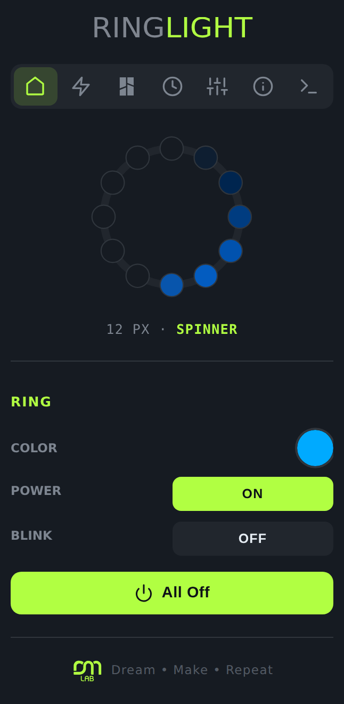
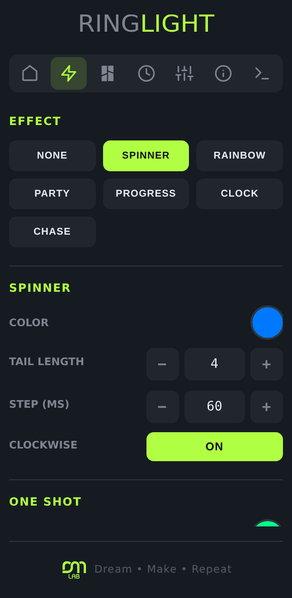
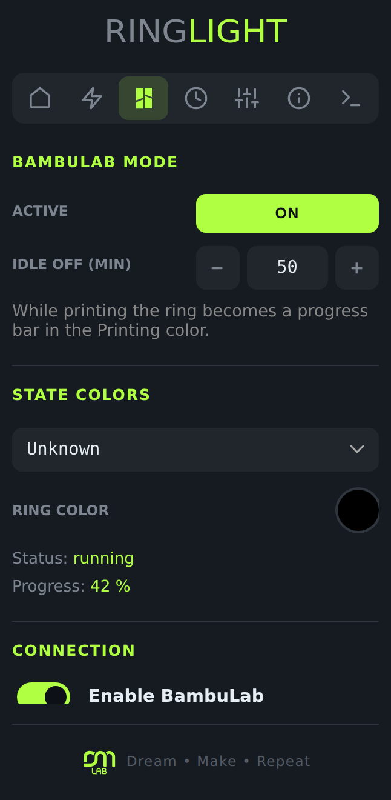
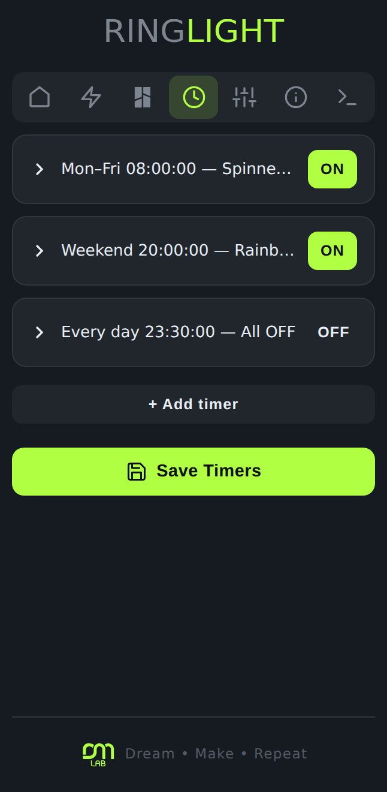
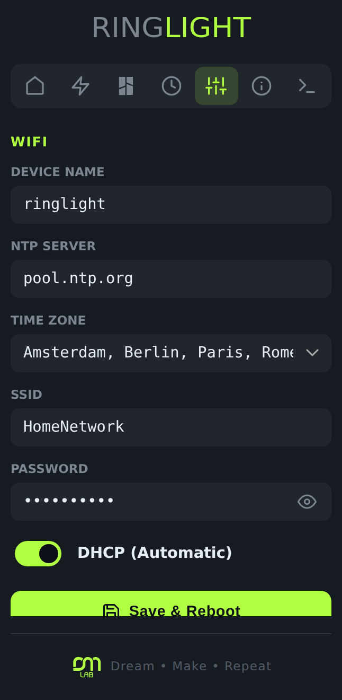
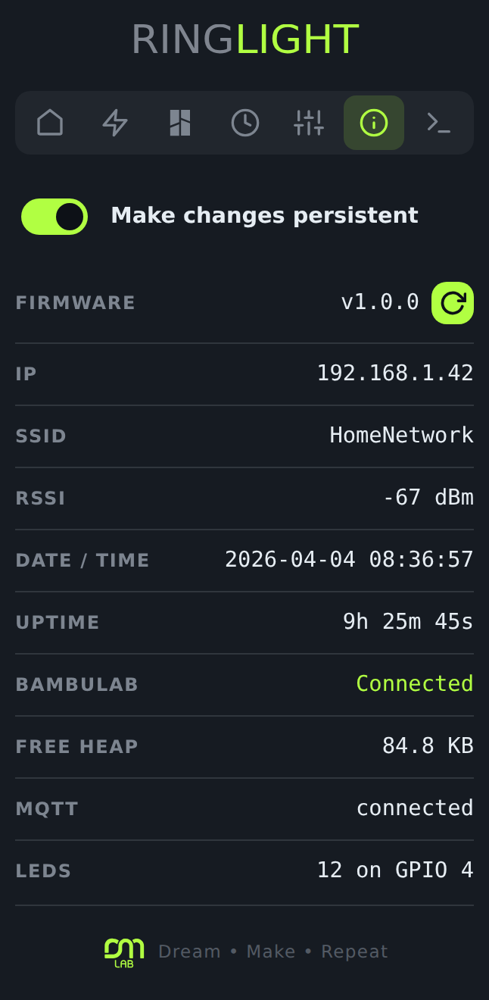

# ESP32-C3 Ringlight

A smart 12-pixel RGB ring based on the **Seeed XIAO ESP32-C3**, controllable from
a browser with a PWA web interface, MQTT / Home Assistant integration, Alexa via
Philips Hue emulation, weekly timers and a BambuLab printer mode.

Built on the same architecture as [ESP32-C3 Semaphore](../ESP32-C3%20Semaphore),
with the three-LED traffic light replaced by a ring and a set of effects that
make sense on a circle.

---

## Hardware

| Component | Detail |
|---|---|
| MCU | Seeed XIAO ESP32-C3 |
| LEDs | 12× WS2812B ring on **GPIO 4** |
| Storage | LittleFS on internal flash |

### Wiring

```
        ┌──────────────────────┐
        │   XIAO ESP32-C3      │
   5V ──┤ 5V              GND  ├── GND
        │          D4 (GPIO 4) ├──────────┐
        └──────────────────────┘          │
                                          │  DIN
                                   ┌──────▼──────┐
                                   │  12-pixel   │
                          5V ──────┤  WS2812B    ├────── GND
                                   │    ring     │
                                   └─────────────┘
```

> **Power.** Twelve pixels at full white draw roughly 720 mA, more than the
> XIAO's 5 V rail is meant to pass through. Feed the ring from its own 5 V
> supply and tie the grounds together. A 300–470 Ω resistor in series with the
> data line and a 1000 µF capacitor across the ring's 5 V and GND are the usual
> precautions.

### Ring orientation

Pixel 0 is whichever pixel the data line reaches first, and a ring can be
mounted at any rotation. Rather than rewiring, the **origin** and **reverse**
settings in the FX tab rotate and flip the ring in software; every effect that
cares about position (progress, clock, wipe) is drawn through that mapping.

---

## Effects

| Effect | Description |
|---|---|
| **Solid** | One colour on the whole ring, with optional 500 ms blink |
| **Spinner** | A comet with a fading tail, configurable colour, tail length, step time and direction |
| **Rainbow** | The full hue wheel spread across the ring, scrolling over a configurable cycle time |
| **Party** | Random per-pixel flashing with an adjustable madness level (1–10) |
| **Progress** | An arc filling 0–100%, with a partially lit pixel for the remainder; fill and track colours are configurable |
| **Clock** | The 12 pixels as a dial, with a configurable colour per hand; hands that land on the same pixel are added together |
| **Theater chase** | Every third pixel lit, stepping around the ring |
| **Colour wipe** | One-shot: fills the ring pixel by pixel, holds a second, then restores |
| **Morse code** | One-shot: the whole ring flashes any text in Morse (A–Z and spaces) |
| **Random yes/no** | One-shot game: bet on green or red, a spin decelerates over 5 s and lands on one of them; the web UI then shows WINNER or LOOSER |
| **Weather colour** | Three arcs of four pixels: condition, temperature, humidity |
| **Air quality colour** | Three arcs of four pixels: PM2.5, PM10, NO₂ |

Continuous effects are mutually exclusive: selecting one releases the others.
One-shot animations take the ring, then hand it back.

---

## BambuLab mode

With a printer configured, the device connects to its built-in MQTT broker over
TLS and follows `gcode_state` and `mc_percent`.

- Each printer state has its own ring colour, editable from the BAMBU tab.
- While **Printing**, the ring becomes a progress bar in the Printing colour and
  tracks `mc_percent` live.
- **Idle off** blanks the ring after the printer has been idle or finished for a
  configurable number of minutes (0 disables it).

Printer credentials live in `/bambu.json`, which is excluded from git.

---

## Web interface

A PWA served from LittleFS at `http://<ip>` or `http://ringlight.local`, with a
live SVG preview that mirrors the firmware's effect maths locally instead of
having the device stream twelve colours several times a second.

It uses the Semaphore's design system unchanged — same stylesheet, same dark
palette and lime accent, same icon tab bar with the sliding indicator, same
ON/OFF pills, number steppers, day chips and DM Design footer — so the two
devices read as one family.

<p>
  
  
  
</p>
<p>
  
  
  
</p>

| Tab | Contents |
|---|---|
| ◉ Ring | Colour, on/off, blink, all off |
| ✳ FX | Effect selection and parameters, one-shot animations, geometry |
| ⬢ BambuLab | Printer mode, per-state colours, connection |
| ◷ Timers | Up to 50 weekly schedules |
| ⚙ Settings | WiFi and MQTT |
| ⓘ Info | Diagnostics, location, weather, backup / restore / OTA |
| ▤ Console | The full serial log, plus the same command set over WebSocket |

---

## WebSocket protocol

`ws://<ip>/ws`, JSON both ways. The same command objects are accepted over MQTT
(`{topic}/cmd`) and over `HTTP POST /cmd`.

### Commands

| Type | Payload |
|---|---|
| `setRing` | `r,g,b,on,blink` — or `brightness` alone to rescale the current colour |
| `getRing` | — |
| `allOff` | — |
| `setSpinner` | `on,r,g,b,tail,speed,cw` |
| `setRainbow` | `on,rainbowCycleTime` |
| `setParty` | `on,partyMadness` |
| `setChase` | `on,r,g,b,speed` |
| `setClock` | `on`, plus optional hand colours `hr,hg,hb` (hours), `mr,mg,mb` (minutes), `sr,sg,sb` (seconds); anything omitted keeps its stored value |
| `setProgress` | `on,pct,fr,fg,fb,br,bg,bb` |
| `setGeometry` | `origin,reverse` |
| `wipe` | `r,g,b,speed` |
| `morse` | `text` |
| `randomYesNo` | `pick` — 1 bets on green, 0 bets on red, omit for a spin with no bet |
| `weatherColor` / `airQualityColor` | — |
| `setLocation` | `latitude,longitude` |
| `setConfig` | `makeChangesPersistent` |
| `getWifi` / `setWifi` | network settings |
| `getMqtt` / `setMqtt` | broker settings |
| `getBambu` / `setBambu` | `ip,serial,accessCode,enabled` |
| `setBambuMode` | `bambuMode,idleTimeoutMin` |
| `setBambuStateColor` | `state,r,g,b` |
| `getTimers` / `setTimers` | timer array |
| `consoleCmd` | `cmd` |
| `startOTA` | — |
| `consoleOpen/Close`, `infoOpen/Close`, `bambuOpen/Close` | tab visibility, so the firmware only pushes what somebody is watching |

### Messages

`ringStatus`, `effectStatus`, `configStatus`, `wifiConfig`, `mqttConfig`,
`bambuConfig`, `bambuStatus`, `timerConfig`, `sysInfo`, `sysInfoStatic`,
`randomResult`, `otaStatus`, `otaProgress`, `console`, `status`.

`randomResult` carries `yes` (the colour that came up), `pick` (the bet, -1 when
there was none) and, when a bet was placed, `win`. The firmware decides the
verdict so every connected client agrees on it; a spin started by a timer or
over MQTT carries no bet and shows no card.

---

## Troubleshooting WiFi

If the device never joins and falls back to the access point, the serial log
says why. Every station event is printed with its reason code, and before
giving up the device scans and lists what it can actually hear:

```
[WiFi] SSID 'MyNetwork' (9 chars), password 12 chars, hostname 'ringlight', dhcp yes
[WiFi] disconnected, reason 202: auth failed - wrong password
[WiFi]   OtherNetwork             ch 6   -54 dBm  WPA2
[WiFi] > MyNetwork                ch 13  -61 dBm  WPA2/WPA3
```

The same information is available at runtime: `wifi` on the console prints the
status and the last failure reason, `wifi scan` lists the networks in range, and
the INFO tab shows a **WiFi error** row whenever a join has failed — which is
what the page served in access point mode is for.

| Reason | Meaning |
|---|---|
| 201 | AP not found — wrong SSID, out of range |
| 202, 15, 17 | Wrong password |
| 203, 204 | Association or handshake failed — often WPA3 or PMF |
| 200 | Beacon timeout — signal too weak |

Three causes are handled rather than merely reported:

- **Channels 12 and 13.** The default regulatory setting only scans them
  passively, so an AP on 12 or 13 never showed up in the active scan that
  `WiFi.begin()` performs — the device reported "AP not found" for a network
  every other device in the house could see. The country is configured for
  channels 1–13 with AUTO policy, which still adopts the AP's own regulatory
  domain from its beacons once associated.
- **Modem sleep is off.** On the ESP32-C3 it is a common cause of missed
  beacons and dropped associations.
- **A scan-assisted last attempt.** After the three normal retries the device
  scans, picks the strongest BSSID for the configured SSID and joins it by
  explicit channel and BSSID. That also covers hidden SSIDs and networks with
  several APs sharing one name.

Retries wait progressively longer (10, 15, 20 s) for routers with band steering
or a slow DHCP server, and access point mode does not reboot after three
minutes: the ten-minute timeout is suspended for as long as a client is
connected, so the device cannot restart while somebody is typing their password
into the setup page.

---

## MQTT / Home Assistant

Auto-discovery publishes:

- **Light** — the ring, JSON schema with RGB
- **Switches** — spinner, rainbow, party, chase, clock, progress
- **Buttons** — Random Yes/No, Weather Colour, Air Quality Colour
- **Sensors** — temperature, humidity, condition, PM2.5, PM10, NO₂, progress, RSSI

Command topics: `{prefix}/cmd` for the JSON protocol above, `{prefix}/cmd/ring`
for the Home Assistant light schema.

---

## Alexa

The device emulates a Philips Hue bridge on the local network — no cloud
account, no skill, no hub. Say "Alexa, discover devices" and five entries appear:

| Name | Function |
|---|---|
| Ringlight | Ring colour and brightness |
| Ringlight spinner | Spinner on/off |
| Ringlight rainbow | Rainbow on/off |
| Ringlight party | Party on/off |
| Ringlight chase | Theater chase on/off |

---

## Timers

Up to 50 weekly schedules with day selection, `HH:MM:SS` time, an action and an
optional duration in seconds (0 = no automatic stop). Actions: `all_off`,
`ring`, `wipe`, `spinner`, `rainbow`, `party`, `chase`, `clock`, `progress`,
`random_yes_no`, `morse`, `weather_color`, `air_quality_color`, `bambu_mode_on`.

---

## Serial & web console

An interactive REPL over USB serial (115200 baud) and from the CON tab, sharing
one command set. Beyond the network, MQTT, BambuLab and weather commands
inherited from Semaphore:

| Command | Description |
|---|---|
| `ring` | Show colour, blink, effect and progress |
| `ring on\|off` | Turn the ring on or off |
| `ring color <RRGGBB>` | Set the ring colour |
| `ring effect <name>` | `none\|spinner\|rainbow\|party\|progress\|clock\|chase` |
| `ring progress <0-100>` | Set the progress percentage |

Type `help` for the full list.

---

## Data persistence

| File | Content |
|---|---|
| `/config.json` | Base colour, active effect and every effect's parameters (including the three clock hand colours), ring geometry, location, BambuLab mode |
| `/wifi.json` | WiFi credentials and IP configuration |
| `/mqtt.json` | MQTT broker configuration |
| `/timers.json` | Timer definitions |
| `/bambu.json` | Printer credentials and per-state colours (excluded from git) |

Writes are debounced by 10 seconds, so dragging a colour picker does not hammer
the flash. The **Make changes persistent** toggle in the INFO tab suspends
saving entirely for temporary setups.

---

## Local development: a default WiFi in the filesystem image

`pio run --target uploadfs` rewrites the whole LittleFS partition, which wipes
`/wifi.json` and leaves the device unreachable until it is reconfigured over the
access point or the Improv wizard. To avoid that during development, keep a
`data/wifi.json` with your network in it: `uploadfs` bakes it into the image, so
the device rejoins the WiFi on the first boot after every filesystem reload.

`data/wifi.json` is listed in `.gitignore`, so the credentials never reach the
repository. `data/wifi.example.json` is committed as the template:

```json
{
  "deviceName": "ringlight",
  "ntpServer": "pool.ntp.org",
  "timezone": "CET-1CEST,M3.5.0,M10.5.0/3",
  "ssid": "YOUR_SSID",
  "password": "YOUR_PASSWORD",
  "dhcp": true
}
```

```bash
cp data/wifi.example.json data/wifi.json   # then fill in ssid and password
```

For a static address, set `"dhcp": false` and add `ip`, `subnet`, `gateway` and
`dns`. Any key you leave out falls back to the default in `WiFiConfigManager`.

Two things to keep in mind:

- The file only seeds the device. Saving WiFi settings from the SETTINGS tab
  overwrites `/wifi.json` on the device; it does not touch your local copy.
- **Never build a release `filesystem.bin` on a machine that has this file**, or
  your credentials ship inside it. A CI build from a clean checkout is safe,
  since git never sees the file. For the same reason the `esp32c3_installer`
  build skips the Improv wizard when the file is present — `improvController`
  only runs the wizard when `/wifi.json` is missing.

The same trick works for `data/config.json`, `data/mqtt.json`,
`data/timers.json` and `data/bambu.json`, which are ignored too.

---

## Build & flash

```bash
# First flash over USB
pio run -e esp32c3 --target upload
pio run -e esp32c3 --target uploadfs

# Afterwards, wirelessly
pio run -e esp32c3_ota --target upload
pio run -e esp32c3_ota --target uploadfs
```

`compress_web.py` runs before every build and gzips `src_data/` into `data/`;
ESPAsyncWebServer serves the `.gz` files directly.

The header wordmark in `src_data/ringlight-logo.svg` is SVG text rather than
outlined paths, so it renders with whatever sans the browser resolves. Drop in
an Illustrator export under the same name to replace it.

The OTA URLs in `src/otaController.h` point at
`GabeMx5/ESP32-C3-Ringlight` — change them to your own repository before using
the firmware update button in the INFO tab.

---

## Project structure

```
├── src/
│   ├── main.cpp              # Entry point, WebSocket, MQTT, HTTP routing
│   ├── ringController.h      # 12-pixel effect engine
│   ├── timerController.h     # Weekly scheduler
│   ├── mqttController.h      # MQTT client + Home Assistant discovery
│   ├── alexaController.h     # Philips Hue bridge emulation
│   ├── networkManager.h      # WiFi STA with AP fallback
│   ├── configController.h    # Load/save config.json, debounced writes
│   ├── wifiConfigManager.h   # Network configuration persistence
│   ├── geoController.h       # Open-Meteo weather and air quality
│   ├── otaController.h       # Firmware + filesystem update from GitHub
│   ├── improvController.h    # Improv Wi-Fi Serial first-boot wizard
│   ├── bambulabController.h  # BambuLab MQTT TLS client and state parsing
│   ├── serialConsole.h       # Serial REPL
│   └── teeSerial.h           # Serial interceptor, mirrors output to the web console
├── src_data/                 # Web UI sources (gzipped into data/ at build time)
│   ├── index.html / index.css / index.js
│   ├── index.css             # the Semaphore stylesheet plus a ring-specific block
│   ├── ringlight-logo.svg    # header wordmark
│   ├── dm-design-logo*.svg   # footer brand mark, shared with the Semaphore
│   └── winner.svg / loser.svg
├── data/                     # LittleFS image root
│   ├── wifi.example.json     # template for the local dev WiFi seed
│   └── wifi.json             # your credentials, git-ignored
├── compress_web.py           # Pre-build script
└── partitions.csv            # Custom partition table (1856 KB OTA slots)
```

### Architecture notes

- **TeeSerial** buffers console lines in a fixed-capacity ring; when it is full
  the oldest line is dropped and counted. `loop()` only drains it while a client
  is on the CON tab, so an unbounded queue would otherwise accumulate every line
  the device ever logged. All access is mutex-protected because Serial is
  written from several FreeRTOS tasks.
- **The BambuLab reconnect** runs in its own task; `_client.loop()` is suppressed
  while it holds the client, since PubSubClient uses one buffer for both
  directions and the mbedTLS context is not thread-safe.
- **The ring overlay** used by BambuLab mode has a short hold time and is
  re-armed from `loop()` every 30 s, so the ring recovers on its own if the
  refresh ever stops.
- **The ring renders on its own FreeRTOS task** (`ring_fx`, priority 2, one
  frame every 10 ms) rather than from `loop()`. PubSubClient pulls a BambuLab
  report through mbedTLS a byte at a time on the main task, which can stall
  `loop()` for over 100 ms and made the animations visibly stutter whenever a
  printer was connected. The frame timer sits above the loop task and below the
  network stack, so the effects keep their timing. Ring state is therefore
  shared between tasks and every public `RingController` method takes a
  recursive mutex — which also closes a pre-existing race, since WebSocket
  handlers already mutated the ring from the AsyncTCP task while `loop()` drew
  it. The ticks never call a callback directly: they raise a flag that
  `dispatchEvents()` fires from `loop()`, keeping WebSocket and JSON work off
  the frame timer.
- **The INFO tab reports "Loop max"**, the longest `loop()` iteration in the
  last second, and `bambu` on the console prints the largest report received.
  Together they show how much the network stack is blocking the main task.
- **The task watchdog** is armed on the Arduino loop task at the end of
  `setup()`: a hang reboots the device instead of leaving it unresponsive.
- **Server-push sysInfo** is split into static (sent at connect and when weather
  refreshes) and dynamic (pushed every second only to clients that declared
  themselves on the INFO or SETTINGS tab). No client-side polling.
